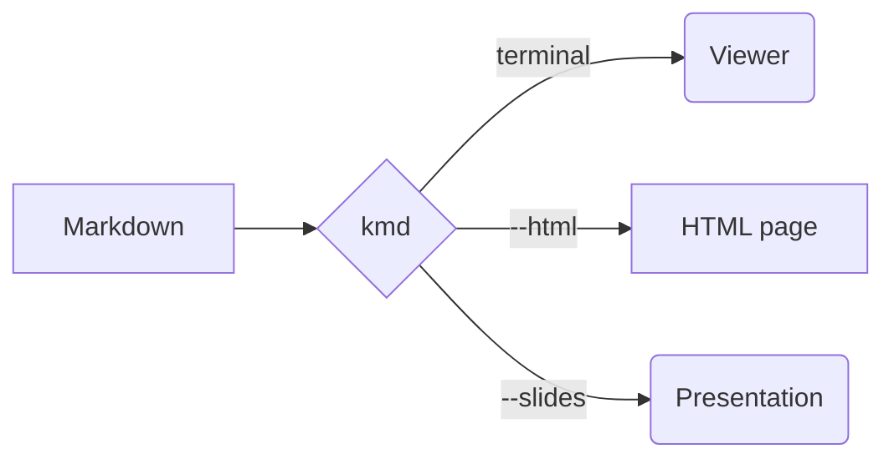
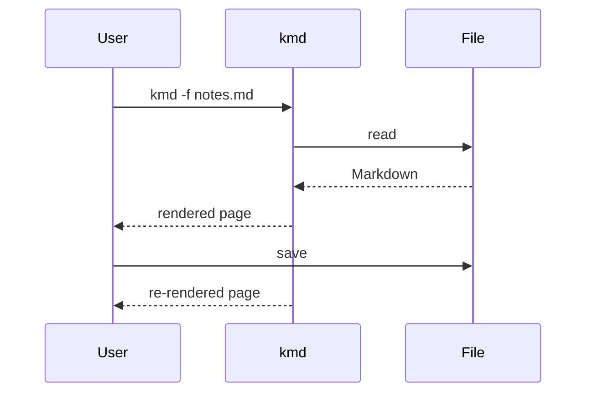
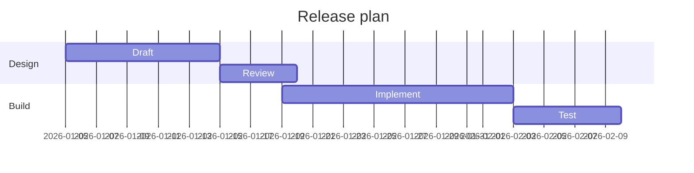

```mermaid
graph LR
  A[Markdown] --> B{kmd}
  B -->|terminal| C(Viewer)
  B -->|--html| D[HTML page]
  B -->|--slides| E(Presentation)
```

```mermaid
sequenceDiagram
  participant U as User
  participant K as kmd
  participant F as File
  U->>K: kmd -f notes.md
  K->>F: read
  F-->>K: Markdown
  K-->>U: rendered page
  U->>F: save
  K-->>U: re-rendered page
```

```mermaid
gantt
  title Release plan
  dateFormat YYYY-MM-DD
  section Design
  Draft      :a1, 2026-01-05, 10d
  Review     :after a1, 5d
  section Build
  Implement  :b1, 2026-01-19, 15d
  Test       :after b1, 7d
```
